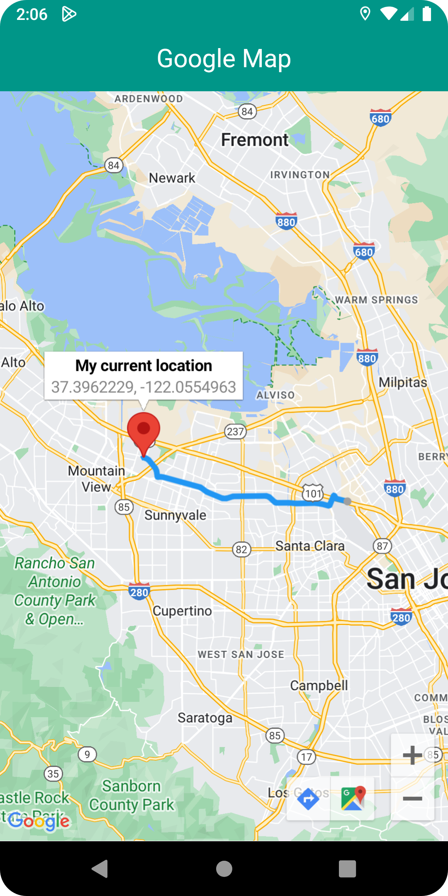
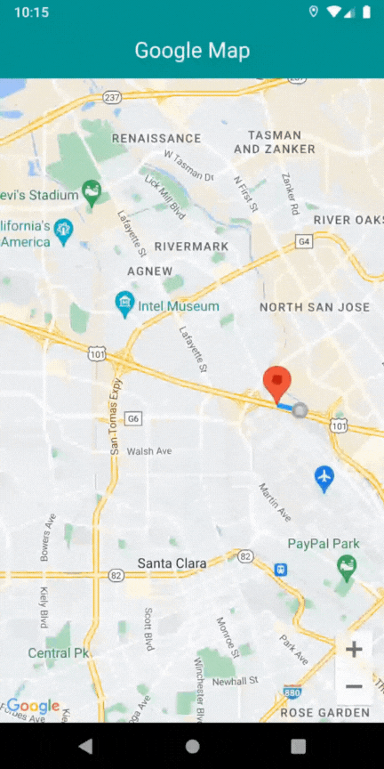

# Google Map Auto Road Tracer

Google Map Auto Road Tracer is a Flutter application that leverages Google Maps and the Geolocator package to track and visualize a user's movement in real-time. As the user moves, the app automatically generates and updates a polyline on the map, effectively tracing the path or road taken by the user.

# Key Features:

<ol>
    <li>
        <b>Real-Time Location Tracking:</b> Continuously tracks the user's current location using GPS and displays it on Google Maps.
    </li>
    <li>
        <b>Dynamic Path Generation:</b> Automatically generates and updates a polyline on the map to represent the user's movement.
    </li>
    <li>
        <b>Google Maps Integration:</b> Provides a rich map experience with markers and polylines using the Google Maps API.
    </li>
    <li>
        <b>Accurate Positioning:</b> Utilizes the Geolocator package for high-accuracy location tracking, ensuring the path is precise.
    </li>
    <li>
        <b>State Management with GetX:</b> Efficient and reactive state management is handled with GetX, ensuring smooth and scalable state transitions.
    </li>
</ol>

This app is ideal for applications requiring real-time location tracking, such as fitness apps, travel logs, or delivery tracking systems.

## Screenshots

    
    

A few resources to get you started if this is your first Flutter project:

- [Lab: Write your first Flutter app](https://docs.flutter.dev/get-started/codelab)
- [Cookbook: Useful Flutter samples](https://docs.flutter.dev/cookbook)

For help getting started with Flutter development, view the
[online documentation](https://docs.flutter.dev/), which offers tutorials,
samples, guidance on mobile development, and a full API reference.
